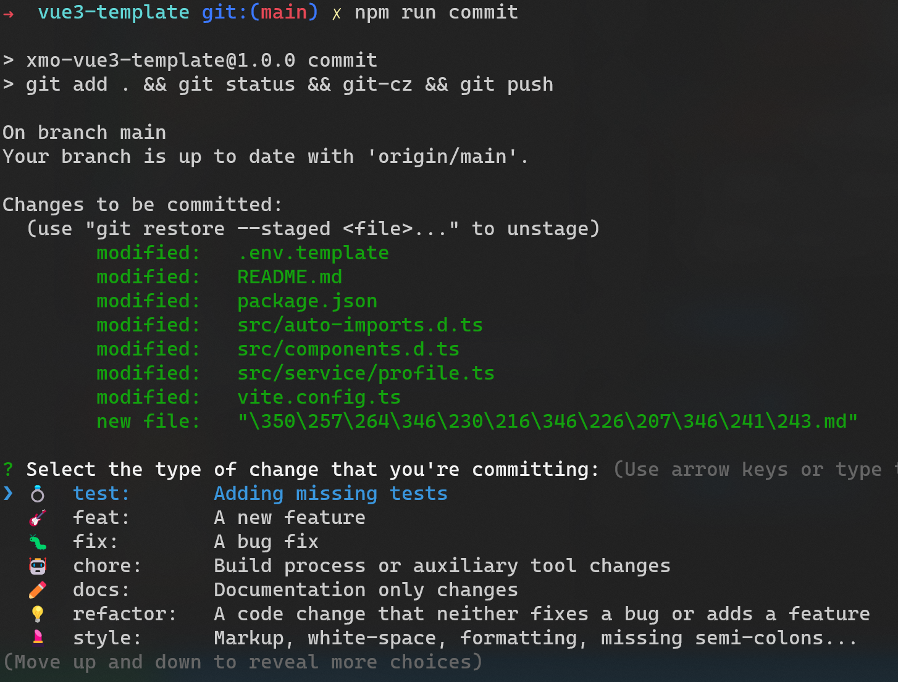

# Xmo-vue3-template 一个旨在用最小成本最大化压榨`Vue3+Vite2`开发效率的后台开发模板

> [github 地址](https://github.com/darkXmo/vue3-template)

> [项目预览地址](https://darkxmo.github.io/vue3-template)

## 前言

_建议先看看代码，再看文章_

### 为什么 WHY

使用 `xmo-vue3-template` ，你将可以

0. 拥有如同新年穿上新内裤一样舒适的开发体验

1. 获得一套开箱即用的后台管理系统
2. 使用规规矩矩的 模块化+分层架构 的代码规范，强迫症福利
3. 节省您的时间和精力
4. 最大化体验 `vite2+vue3+typescript` 的开发魅力

5. 同时，由于会持续根据技术迭代更新本模板，关注本模板，将能在后续同步体验到经过作者验证的最佳开发效率化方案。
6. 最后，本项目每个关键点都有注释，有任何不理解的地方可以提交`issue`要求增加注释。

### 怎么做 HOW

`xmo-vue3-template` 拥有以下几个属性。其中可能有你没有听说过的内容，而如果你希望尝试最佳的开发体验，我推荐你去了解它们，你会获得`Vue`项目焕然一新的开发体验。

1. 使用 `prettier` `commitlint` `git-cz` 和 `husky` 进行质量管理；
2. 项目结构采用模块化(`modules`)设计而非传统的组件化设计(`components`)；
3. 利用丰富的 `vite` 插件，减少`api`和组件 `import`导入；
4. 利用 `typescript` 进行代码类型保障，尤其注意前后端类型的统一；

## 质量管理

1. [`prettier`](https://prettier.io/)可以为你提供代码格式的一致化，例如

   1. 代码应该有多少缩进；

   2. 什么时候要换行；

   3. More...

      你可以有自己的代码风格，但是它有可能会导致混乱，相比之下，`prettier`原版代码风格则能为你和你的团队提供稳定的开发体验，而不必为代码格式不一致而发愁，减少看不懂别人或自己以前的代码的情况。

      > Q: 为什么不使用`eslint`;
      > A: `eslint`使用门槛相对比较高，另外`eslint`的规范并不统一，还对开发具有侵入性。`eslint`本质上应当搭配`javascript`使用，而在善用`typescript`的前提下，很少有`eslint`的使用空间；

2. [`commitlint`](https://github.com/conventional-changelog/commitlint) + [`git-cz`](https://github.com/streamich/git-cz) 让你的`git commit`提供有效的信息

   大多数时候的大多数开发者的`git commit`都是 shit，基本无法提供有效信息。使用这两个插件提供`commit`规范，以优化这种现象。

   

   不合格的`commit`会被阻止。

   > 强行提交空的`commit`信息: `git commit -m "chore: none"`

3. [`husky`](https://typicode.github.io/husky/#/)

   `husky` 能够劫持 `git` 操作，搭配 `lint-staged` ，可以在 `git commit` 的时候自动帮你格式化代码(默认使用`prettier`)。

## 模块化结构

| 特点     | 组件化                                       | 模块化                                          |
| -------- | -------------------------------------------- | ----------------------------------------------- |
| 组件位置 | 所有`vue`组件都放在`components`文件夹中      | 所有`vue`组件都放在`modules`文件夹中            |
| 页面位置 | `views`或`pages`文件夹                       | `modules` 文件夹                                |
| 相对关系 | 功能相似的组件都放在一起(例如`Form`,`Table`) | 业务相近的组件都放在一起（例如`Login`, `User`） |
| 引用方式 | `import xxx from "@/components/yyy/xxx.vue"` | `import xxx from "./xxx.vue"`                   |
| 关注点   | 关注功能和可复用性                           | 关注业务和页面展示结构                          |
| 复用性   | 直接复用组件                                 | 复制出一个新的组件到自己的模块进行复用          |

### 组件化的缺点

1. 很多时候，`Vue`开发都容易陷入为可复用而可复用的情况。（实际上并没有那么多需要可复用的组件，却容易创建了多余的可复用组件）

2. 两个组件明明业务相差甚远，却还是要通过`props`进行可复用性的属性处理，一旦出现业务修改，就可能要为了保留复用性，对单个组件进行复杂的逻辑修改。

3. 只通过组件名称，难以确认组件化的组件的具体功能，也无法快速定位组件的使用场景。

4. 团队协作的时候不方便进行职责划分。

### 模块化的优点

1. 组件减少对复用性的关注，专注于真实的业务需求。

   1. 等到确实出现需要大范围复用的场景时，再在`components`文件夹注册可复用组件也不迟

2. 业务紧密；通常的模块方案是页面区分，即每个页面区分出一个模块来，每个模块对应页面的各个部分，所见即所得，减少心智成本。

3. 利于团队协作，进行团队开发的时候，每个成员可以创建出属于自己的模块，开发的时候仅在自己的模块下进行，既不需要引用它人的模块，也不需要担心其他人的开发对自己的影响。

   1. 如果出现与其它模块类似的结构，可直接复制出一个新的组件

4. 效率更高。

### 模块化 + 分层 的具体实施方案

1. 视图层按页面模块化（`modules`按页面区分，管理`vue`文件及少量用于跨组件数据管理的`ts`文件，每个页面划分出一个模块），页面内再根据组件的位置划分出多个子组件。

2. 逻辑层按功能模块化，传统前端只需要区分出三个模块

   1. `api`模块 - 定义与后端接口的`axios`请求及后端数据类型。

   2. `config`模块 - 定义全局静态配置信息。

   3. `service`模块 - 定义具体的功能项

      1. 例如在`auth`模块，定义`login`和`logout`方法，以及响应式的`profile`(用户个人信息)对象。

3. 视图层引用逻辑层的方法，逻辑层之间互相引用。

> `api`模块定义的是跟后端一一对应的接口，命名方式为 `Method + 接口名`，例如登录行为就是 `PostLoginForm` ;

> 而 `service` 定义的则是具体的功能，命名需要体现其行为后果。登录就是`login`，登出就是`logout`，开发者引用`service`中的功能的时候，不再需要在意其中的具体实现；

> 虽然`router`和`assets`也被单独区分出来，但它们并不具备与其它模块的交互性。(`assets`管理全局样式，而`router`管理全局路由)

## vite 插件

插件已引入，普通开发者无需关心。

- `Vite` 自动引入 - 使用详情可参照[本文](https://juejin.cn/post/7012446423367024676)

  - `unplugin-auto-import` 全局自动隐式 `import` 导出 - 通常用于导入 `vue` `vue-router` 的导出 - 已配置
  - `unplugin-vue-components` 全局自动隐式 `import` `Vue` 组件 - 通常用于导入 `element-plus` 等公共组件库的组件 - 默认配置 `element-plus`
  - `vite-plugin-style-import` 全局自动引入 `import` 样式文件 - 通常用于导入 `element-plus` 等公共组件库的样式文件
    > 注意 `v2.0.0` 版本存在 `bug` ，不要手动 `install` 最新版本。

  > `unplugin-auto-import` 和 `unplugin-vue-components` 会分别生成 `auto-imports.d.ts` 和 `components.d.ts` 声明文件，由于这两个声明文件会在开发阶段反复生成，容易产生`git`垃圾，因此可以将他们置入到`.gitignore`中。但这种方式会导致缺少声明文件，而无法正常`vite build`，因此在`build`之前，应当首先生成好完整的声明文件。

- `rollup-plugin-visualizer` 打包的时候生成各模块占用的可视化。

- `vite-plugin-svg-icons` - 引入 `svg` 原生图标 - 已配置，搭配 `SvgIcon` 组件使用

## 善用 typescript

如果是团队协作，使用`typescript`首先需要评估，你的同事究竟会不会`typescript`，会到什么程度？
我将`typescript`能力区分成以下几个等级。

1. LV1 啥都不会，第一次听说或第一次用 `typescript` 或者只会`any`;
2. LV2 会一点，能用`interface`构建简单的对象；
3. LV3 有`typescript`项目的实战经验，知道泛型`<T>`和`type`定义稍微复杂的类型；
4. LV4 深入了解过`typescript`，能够使用泛型，`infer`和类型遍历定义高级类型，知道怎么定义全局类型，扩展一般对象；
5. LV5 熟练使用`typescript`开发，通关[`typescript`类型体操](https://github.com/type-challenges/type-challenges)。

开发`typescript + vite`项目，普通成员至少要达到 LV2 的水平，而团队组长至少要有 LV3 的水平，才能发挥出 `typescript` 的优势，否则两眼一抹黑，处处都是`any`、`ts-ignore`或者报错。

本项目使用`typescript`的收益则分为以下几个方面。

1. 为了最小化成员的能力要求，项目推荐优先在 `api` 文件夹，即`axios`与后端的交互中使用`typescript`定义类型。由于前后端的交互中产生最多数据模型，对它们进行类型定义的收益是最大的。

2. 其次是在 `ref` 和 `reactive` 的响应式对象中定义简单的类型，例如 `ref<string>()` 和 `const a: {} = reactive({})`。它们能最大化体现`volar`+`vue3`的开发优势。

> 本项目由于声明了全局类型，所以可以在不主动引用的前提下，使用 `ref<Resquest.Auth.LoginForm>` 生成

3. 结合 后端和响应式 类型+`volar`，可以覆盖`95%`的需求，让开发布满类型提示，门槛也不会太高。

## 结语

```
Talk is cheap. Show me the code.
```
